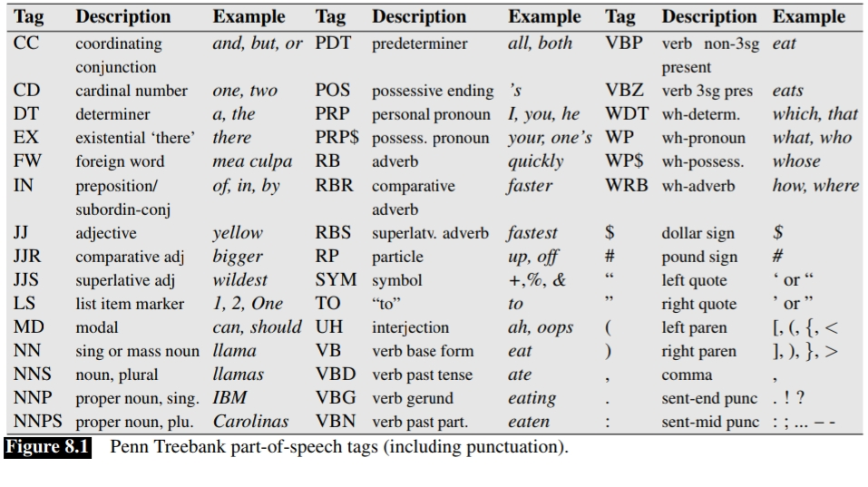
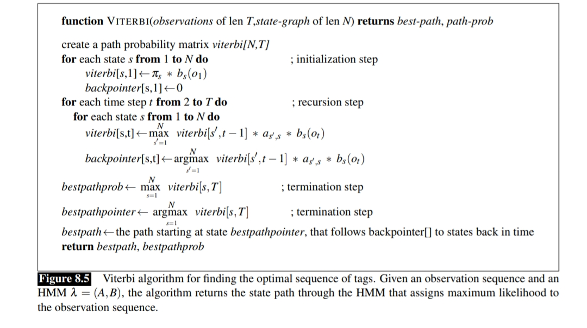

# 🧠 POS Tagging using HMM and Viterbi Algorithm

**Part-of-Speech (POS) Tagging** is a fundamental task in Natural Language Processing (NLP) that involves assigning a grammatical category (e.g., Noun, Verb, Adjective) to each word in a sentence.  

This project implements a **statistical POS tagger from scratch** using **Hidden Markov Models (HMM)** and the **Viterbi algorithm**. It was developed as part of my journey through the **Coursera NLP Specialization**.

---

## 📚 Why POS Tagging?

The goal of POS tagging is to understand the **syntactic structure** of language and identify the grammatical role of each word. This information is essential for a wide range of NLP tasks, such as:

- Text analysis
- Named Entity Recognition
- Information extraction
- Machine translation

---

## 🧩 Key Concepts in POS Tagging

### 1️⃣ POS Tags  
POS tags represent parts of speech such as:

- Noun
- Verb
- Adjective
- Adverb
- Pronoun
- Preposition
- Conjunction
- Determiner
- Interjection

---

### 2️⃣ Tagsets  

A **tagset** is a collection of labels used to annotate words with their respective POS tags. Different tagsets exist, but the most widely used for English NLP tasks is the **Penn Treebank POS Tagset**.



### 3️⃣ Ambiguity

POS tagging is inherently a disambiguation task. Words can take on multiple POS depending on context. For example, book can be a verb (book that flight) or a noun (hand me that book)

## Method used: 
Statistical and probabilistic method have been used in this task.

- 1- Bayesian Method: it achieved 88% accuracy as it was trained a large annotated corpora to predict POS Tags
- 2- Statistical Methods: Viterbi + Hidden Markov Model (HMM) as it achieved 95% accuracy
as states are hidden we infer the tags by analysing word sequence so our hidden states are POS Tags we need to infer and Observations are Words observed from the corpus


in our implementation we defined our components which they are:
- 1- Q = q1, q2, ..., qm (set of hidden states)
- 2- A (Transition probability matrix) as it states the probability of moving from one state to the next state
- 3- B (Emission probability matrix) as it states the probability of generating observation o from state q
as we faced the problem of some states doesn't occuer next to each other so their probability will be zero, we used laplacian smoothing so that they have
equal probability to be selected.
the decoding algorithm for HMM is Viterbi algorithm which resembles the dynamic programming minimum edit distance algorithm.



## Dataset Used
- WSJ_02-21.pos: Training corpus (tagged)
- WSJ_24.pos: Test corpus (tagged)
Both files are based on the Penn Treebank WSJ subset

Vocabulary
hmm_vocab.txt: Word list extracted from training corpus


---
## How to Run:
### 1- Clone the repo
```
git clone https://github.com/Aliha7ish/NLP-Fundamentals.git
cd NLP-Fundamentals/POS Tagging
```

